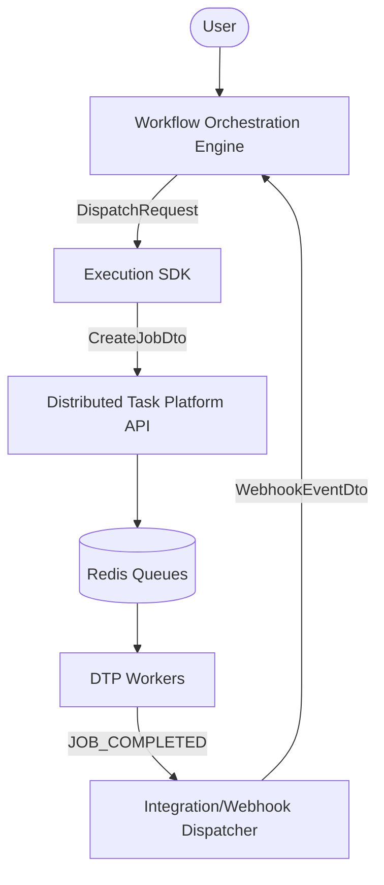

# Workflow Platform Architecture Specification

## 1. Vision

To provide a highly scalable, resilient, and decoupled orchestration system where the definition and control of workflows (orchestration) are entirely isolated from the execution of individual tasks (execution).

## 2. Problem Statement

Historically, orchestration platforms tightly couple workflow semantics (DAG resolution, state machines) with task execution (queues, workers, polling). This coupling leads to complex scaling bottlenecks, rigid deployment models, and monolithic codebases. We need a system where the orchestrator manages _what_ happens and _when_, while a specialized execution platform handles _how_ to reliably execute arbitrary work under distributed failure conditions.

## 3. System Context

The Workflow Platform consists of two primary independent systems connected via a formal API contract:

- **Workflow Orchestration Engine (WOE)**: The "brain" that defines workflows, resolves dependencies, and manages state.
- **Distributed Task Platform (DTP)**: The "brawn" that manages queues, schedules execution, and recovers from transient failures.

## 4. High-Level Architecture

## 5. Bounded Contexts

- **Orchestration Context (WOE)**: Owns Workflow Definitions, Task Definitions, Lineage, Dependencies, and Replay. Uses `TaskRun` and `WorkflowRun` domain language.
- **Execution Context (DTP)**: Owns Jobs, Workers, Schedulers, Redis Queues, Optimistic Concurrency Control (OCC), and Retries. Uses `Job` and `Worker` domain language.
- **Integration Context (Anti-Corruption Layer)**: Translates between the two domains. No internal engine logic leaks across this boundary.

## 6. Control Plane (WOE)

Built with NestJS and PostgreSQL. The WOE never executes a user-defined task. It resolves the DAG, dispatches tasks when dependencies are met, and idles until a webhook wakes it up. It tracks complete lineage and historical replayability.

- **State Updates**: DTP workers push status updates (via HTTP or Webhooks) back to WOE.
- **Optimistic Concurrency**: WOE uses Prisma's atomic `updateMany` to ensure state transitions (e.g., `PENDING` -> `RUNNING`) are safe against race conditions.

### Cancellation Semantics

- **Workflow Cancellation**: Users can cancel a running workflow via the WOE API (`POST /workflow-runs/:id/cancel`).
- **Atomic Halting**: When cancelled, WOE halts the DAG progression immediately. Any `PENDING` or `SCHEDULED` tasks are atomically marked as `CANCELLED`.
- **DTP Propagation**: WOE propagates the cancellation down to DTP via the `cancelJob` SDK method to halt in-flight tasks.

## 7. Execution Sandbox (DTP)

DTP workers execute untrusted code in a strictly isolated environment. Node's built-in `vm` module is **never** used as a security boundary.

- **JavaScript Execution**: SCRIPT tasks use `isolated-vm` to run arbitrary user code in a dedicated V8 isolate with strict memory (128MB) and timeout limits.
- **Expression Evaluation**: CONDITION expressions are evaluated securely via `expr-eval`, an AST-based mathematical expression parser, avoiding any risk of JS injection.

## 8. Execution Plane (DTP)

Built with Express, Redis, and PostgreSQL. The DTP never understands workflows, DAGs, or dependencies. It treats every request as an isolated `Job` with a `type` and an opaque `payload`. It ensures workers reliably process these jobs and handles worker crashes, priority queueing, and timeouts.

## 9. Shared Libraries

- **`execution-contract`**: TypeScript interfaces defining the API boundary (`DispatchRequest`, `WebhookEventDto`).
- **`execution-sdk`**: A client library that implements the Anti-Corruption Layer. It translates `DispatchRequest` into DTP's native `CreateJobDto`, ensuring WOE remains agnostic to DTP's schema evolution.

## 10. Integration Flow

1. WOE identifies a task is ready.
2. WOE calls `ExecutionClient.dispatch(request)`.
3. `execution-sdk` translates the request and attaches a `callback` object containing the `webhookUrl` and `apiKey`.
4. SDK makes an HTTP POST to DTP API using a machine-to-machine `x-api-key`.
5. DTP executes the job.
6. Upon completion/failure, a Redis Event wakes the DTP `WebhookDispatcherService`.
7. DTP translates the internal event into a `TASK_COMPLETED` webhook payload using `ExecutionEventMapper` and attaches a deterministic `eventId`.
8. DTP POSTs the signed webhook to WOE.

## 11. Security

- **Human Access**: JWT-based authentication for UI and CLI users interacting with DTP/WOE.
- **Machine Access**: API Keys (`x-api-key`) with HMAC SHA-256 webhook signatures (`x-signature`) for system-to-system boundary communication.

## 12. Failure Recovery & Cancellation

- **Worker Crash**: DTP's scheduler detects inactive workers via heartbeat timeouts, recovers stranded jobs, and requeues them automatically. WOE remains oblivious to these transient faults.
- **Webhook Failure**: DTP implements bounded retries for webhook delivery.
- **Duplicate Delivery**: WOE tracks `processedWebhookEvent` by `eventId` in Postgres to achieve true idempotency.
- **Workflow Cancellation**: When a user cancels a workflow (or if a task fails triggering a fail-fast halt), WOE automatically iterates over pending/running tasks. It updates its local state (marking unexecuted tasks as `SKIPPED`) and pushes cancellation signals down to DTP via the `execution-sdk` to gracefully release worker capacity.

## 13. Replay & Lineage

WOE retains the complete graph of task inputs and outputs. A workflow can be replayed from any failed node by re-dispatching identical `DispatchRequest` payloads, guaranteeing deterministic re-execution.

## 14. Deployment

The system is designed for containerized deployment (e.g., Kubernetes). WOE, DTP API, and DTP Workers scale independently.

## 15. Scaling

- **WOE**: Horizontally scalable; relies on Postgres transaction isolation.
- **DTP API**: Stateless, horizontally scalable behind a load balancer.
- **DTP Workers**: Independently scalable consumer group pulling from Redis queues.

## 16. Observability

Each boundary transition logs deterministic trace IDs (`traceparent`, `correlationId`). Latency is tracked by capturing `dispatchedAt` in the SDK and comparing it against the execution time upon webhook receipt.

## 17. Architecture Decision Records (ADRs)

### ADR-001: Separation of Orchestration and Execution

**Decision**: Physically decouple WOE and DTP into separate services.
**Rationale**: Orchestration is state-heavy and IO-bound; execution is compute-heavy and failure-prone. Isolating them prevents worker crashes from impacting the control plane.

### ADR-002: Reusing the Express DTP over BullMQ

**Decision**: Maintain the existing custom Redis-backed DTP instead of replacing it with BullMQ.
**Rationale**: The existing DTP already implements advanced distributed systems patterns (OCC, Worker Recovery, Leader Election) that would take significant time to recreate. Integrating it via an Anti-Corruption Layer provides immediate operational maturity.
