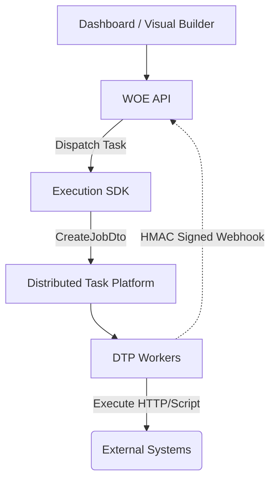

# Workflow Orchestration Engine (WOE)

The **Workflow Orchestration Engine (WOE)** acts as the **Control Plane** for building, monitoring, and managing complex distributed workflows. It defines the state machine, resolves Directed Acyclic Graphs (DAGs) of dependencies, and delegates the actual heavy lifting to the Distributed Task Platform (DTP) for execution.

## Architecture at a Glance

WOE delegates execution to the Distributed Task Platform (DTP) using an Anti-Corruption Layer (the Execution SDK):



WOE guarantees **at-least-once execution with idempotent consumers**. Retries are configured in WOE but **executed exclusively by DTP**. Side-effects (like non-idempotent HTTP calls or sending emails) may execute multiple times at the effect boundary if transient failures occur.

## 🚀 Quick Start & Setup

### Prerequisites

- Node.js 20+
- `pnpm`
- Docker (for PostgreSQL & Redis)

### 1. Install Dependencies

```bash
pnpm install
```

### 2. Configure Environment

```bash
cp .env.example .env
```

Ensure you have the connection strings for PostgreSQL. If DTP is running locally, ensure `DTP_API_KEY` matches DTP.

### 3. Database Migration

```bash
pnpm prisma migrate dev
```

### 4. Start Local Development Server

```bash
pnpm dev
```

The Dashboard is available at [http://localhost:3001](http://localhost:3001) (when running via Docker, or if `next dev` falls back from 3000 which is used by the API).

### Hermetic E2E Test

To verify cross-service communication without external dependencies:

```bash
docker compose -f docker-compose.e2e.yml up -d --build
node e2e_success.cjs
```

This script will orchestrate a full test workflow. Upon success, you'll see a terminal success message. You can pipe the script output to `e2e-proof.txt` (e2e_success.cjs > e2e-proof.txt) to capture the proof.

---

## 🎨 Creating a Workflow in the Canvas

The Next.js Dashboard features a **Workflow Studio** for visual DAG design.

1. **Add Nodes**: Drag nodes onto the canvas. Each node requires:
   - **Name/ID**: A unique identifier for the task.
   - **Timeout (ms)**: Max duration before DTP marks the task as failed.
   - **Max Retries**: The retry policy WOE will request DTP to honor.
   - **Dependencies**: Edges connecting upstream nodes. A node only runs when all its dependencies complete successfully.

2. **Select Handlers**: Each node executes a specific action. WOE defines these handlers, but DTP actually executes them:
   - `core/http`: Makes HTTP requests. Requires `url`, `method`.
   - `core/condition`: Branches the workflow. Evaluates `expression` (e.g., `previousOutput.value == true`) to conditionally activate downstream routes.
   - `core/script`: Runs arbitrary JavaScript. Requires `code`. Evaluates in an `isolated-vm` sandbox in DTP.
   - `core/parallel` & `core/join`: Native fan-out/fan-in branching logic.
   - `core/email`: Sends emails (Stubbed to Ethereal in DTP testing).
   - `core/ai`: AI text generation (Stubbed mock in DTP testing).
   - `core/template`: Evaluates text templates with JSON variables.

3. **Deploy & Monitor**:
   - Click **Validate** to ensure DAG acyclic integrity.
   - Click **Publish** to create a new immutable version.
   - Run the workflow and view live status transitions: `PENDING → RUNNING → COMPLETED` or `FAILED`.
   - Workflows can be manually **Cancelled** via the UI, which will cascade cancellation signals to DTP.

## Replay from Checkpoint

WOE supports **Clone-based Replay**. Instead of event sourcing, WOE implements replays by cloning the state of a terminal workflow run into a new `WorkflowRun` database record and re-dispatching from the failed node. This guarantees deterministic re-execution from the checkpoint.

## Metrics & Tracing

- **Metrics**: The dashboard metrics (like `94.2% completion rate`) are currently populated with **Demo Data** for presentation.
- **Distributed Tracing**: Full W3C `traceparent` tracing across WOE and DTP is currently an aspirational design and partially stubbed.
