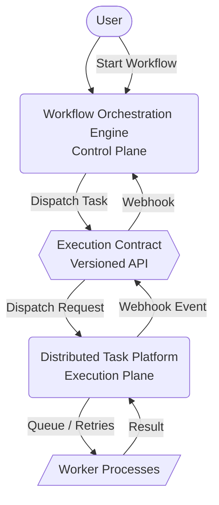

# System Architecture

This document describes the canonical architecture of the workflow platform, which is strictly divided into a **Control Plane** and an **Execution Plane**, separated by a versioned integration contract.

## System Overview

---

## Control Plane Responsibilities

The **Workflow Orchestration Engine (WOE)** acts as the pure control plane.

- **Workflow Definitions**: Storing and versioning workflow DAGs (Directed Acyclic Graphs).
- **DAG Resolution**: Determining which tasks are ready to run based on dependencies.
- **State Machine**: Managing logical task states (PENDING, SCHEDULED, RUNNING, COMPLETED, FAILED, SKIPPED).
- **Replay**: Enabling execution replays from historical terminal states while preserving immutability.
- **Lineage**: Tracking the lineage between original and replayed executions.
- **Scheduling Decisions**: Instructing the execution plane _what_ to run.

---

## Execution Plane Responsibilities

The **Distributed Task Platform (DTP)** acts as the pure execution plane.

- **Queue Management**: Enqueueing tasks dispatched by the control plane.
- **Workers**: Providing runtime environments for handler execution.
- **Retry Engine**: Automatically executing retries according to the dispatched retry policy.
- **Heartbeats & Recovery**: Detecting stuck/dead workers and recovering tasks.
- **Dead Letter Queue (DLQ)**: Capturing tasks that exhaust all retries.
- **Horizontal Scaling**: Scaling workers dynamically based on queue depth.

---

## Shared Contract

The two planes communicate _exclusively_ via a versioned contract (`@local/execution-contract`), completely decoupled from underlying infrastructure (e.g., Redis, BullMQ).

### Integration Lifecycle

1. **Dispatch**
   - WOE resolves a task and dispatches an `ExecutionApiV1DispatchRequest` to DTP.
2. **Execution**
   - DTP accepts the dispatch, queues the task, and manages all retries/timeouts.
3. **Webhook Event**
   - DTP reports terminal execution outcomes (or status changes like `TASK_STARTED`) to WOE via an `ExecutionApiV1WebhookEvent`.
4. **Reconciliation**
   - WOE processes the authenticated webhook, updates the logical state machine, and loops back to step 1 to dispatch downstream dependencies.

---

## Design Principles

- **Control plane never executes code**: WOE is strictly responsible for orchestration; it has no knowledge of how to execute a handler.
- **Execution plane never understands topology**: DTP has no concept of workflows, DAGs, or dependencies. It simply executes isolated tasks.
- **Communication only through the execution contract**: Neither system imports code from the other. Transport details are hidden behind `execution-sdk`.
- **Historical executions are immutable**: A terminal workflow run cannot be restarted or mutated.
- **Replay always creates a new runtime**: Replaying a workflow generates a completely new WorkflowRun with lineage pointing to the original, preserving audit trails.
